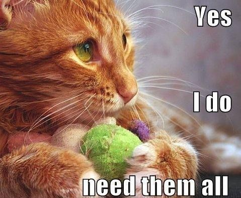

## Twitter Images List

Have you ever dreamed of a tool capable of collecting all the photos of cats posted on Twitter by Internet users from all over the world?

Well this project is for you, and it consists of three modules.
First of all, if you don't already have one created, create a new GCP project [here](https://console.cloud.google.com), and turn the billing on.
Then follow the docs to get up and running.

Note: when copy pasting parts of this docs, you will need to replace every occurences of `$PROJECT_ID` by your GCP project id.

Ready? Then git clone this repository locally, and get through the installation detail for each of the three components.

- [The images API](images-api)
- [The web gallery](web-gallery)
- [The Twitter streaming client](streaming-client)
